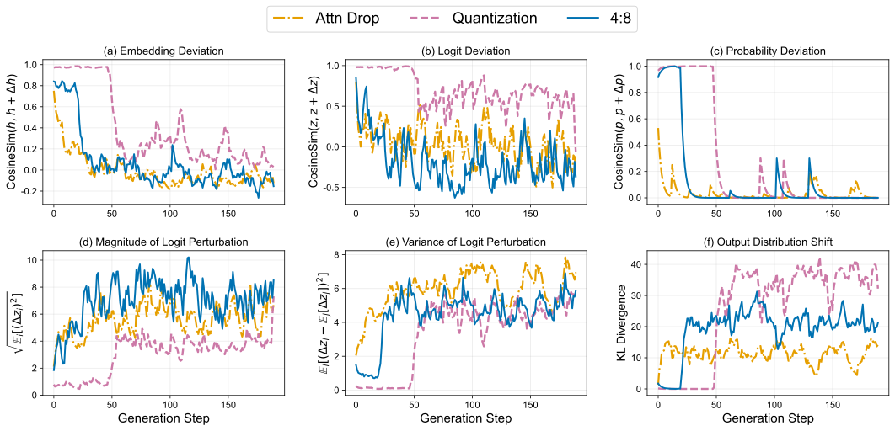

<h1 align="center">Demystifying When Pruning Works via Representation Hierarchies</h1>

<p align="center">
  
  
  
  
</p>

<p align="center">
  Shuai He<sup>1</sup>, Guoheng Sun<sup>1</sup>, Haichao Zhang<sup>2</sup>, Yun Fu<sup>2</sup>, Ang Li<sup>1</sup><br/>
  <sup>1</sup>University of Maryland, College Park, <sup>2</sup>Northeastern University
</p>

<p align="center">
  <a href="#background">🧩 Background</a> •
  <a href="#repository-structure">📦 Structure</a> •
  <a href="#environment">⚙️ Environment</a> •
  <a href="#analysis-scripts-paper-aligned">🔍 Scripts</a> •
  <a href="#quick-start">🚀 Quick Start</a> •
  <a href="#notes-on-metric-definitions">🧪 Metrics</a>
</p>

<p align="center">
  Codebase for representation-hierarchy analysis of pruning in LLMs.
</p>

<p align="center">
  
</p>
<p align="center">
  <em>Figure 1: Overview. This repo studies pruning through a representation hierarchy (`h → z → p`) and compares dense vs dropped/pruned behaviors.</em>
</p>

Pruning often preserves non-generative metrics but hurts autoregressive generation.
This project studies that gap through a representation hierarchy:
- **Embedding space** (`h`): hidden states
- **Logit space** (`z`): pre-softmax outputs
- **Probability space** (`p`): post-softmax distributions

Empirically, pruning can perturb these spaces **very differently**: hidden-state similarity may remain high while probability-space similarity (and thus decoding behavior) diverges more substantially—especially as effects accumulate across layers.

<table align="center">
  <tr>
    <td align="center" width="50%">
      
    </td>
    <td align="center" width="50%">
      
    </td>
  </tr>
</table>
<p align="center">
  <em>Figure 2: Representation hierarchy under pruning. Layerwise cosine similarity trends can differ across embedding/logit/probability spaces (left: Attention, right: MLP).</em>
</p>

**What You Can Run Here**
- Inter-layer pruning (layer / block drop)
- Intra-layer pruning (WANDA / SparseGPT)
- Representation-level analysis in `dropped` and `pruned` modes

## Background

A recurring **discrepancy** in pruning is that models can look “mostly fine” on **non-generative** evaluations (e.g., classification-style accuracy, multiple-choice selection, or short-form scoring based on fixed inputs/outputs), yet degrade noticeably on **generative** evaluations (autoregressive decoding where errors compound over steps).

This repo is built to diagnose that gap by measuring how pruning perturbs representations across a hierarchy (`h → z → p`) and how those perturbations translate into decoding-time divergence.

<p align="center">
  
</p>
<p align="center">
  <em>Figure 3: Pruning often preserves non-generative metrics (single-step / fixed-target evaluations).</em>
</p>

<p align="center">
  
</p>
<p align="center">
  <em>Figure 4: Pruning can hurt generative quality due to compounding errors during autoregressive decoding.</em>
</p>

### Additional visualizations

<table align="center">
  <tr>
    <td align="center" width="50%">
      
    </td>
    <td align="center" width="50%">
      
    </td>
  </tr>
</table>
<p align="center">
  <em>Figure 5: Example layerwise signals. Cosine similarity and KL divergence can show different sensitivity across spaces at the same layer (illustrative Attention layer).</em>
</p>

<p align="center">
  
</p>
<p align="center">
  <em>Figure 6: Generation-time divergence can accumulate across decoding steps, producing qualitatively different outputs.</em>
</p>

<p align="center">
  
</p>
<p align="center">
  <em>Figure 7: Pruning vs quantization (illustrative). Different compression operators can shift where the discrepancy appears across the hierarchy.</em>
</p>

<table align="center">
  <tr>
    <td align="center" width="50%">
      
    </td>
    <td align="center" width="50%">
      
    </td>
  </tr>
</table>
<p align="center">
  <em>Figure 8: Subspace vs global behavior. Comparing answer-option subspaces with full-vocabulary behavior reveals why some non-generative scores remain stable.</em>
</p>

## Repository Structure

- `inter-layer/`: layer/block dropping pipeline.
- `intra-layer/`: intra-layer sparsification (WANDA / SparseGPT).
- `representation-analysis/`: paper-aligned analysis scripts for representation hierarchy.

## Environment

Recommended:
- Linux + NVIDIA GPU
- CUDA-compatible PyTorch
- Python 3.9+

Core dependencies:
- `torch`
- `transformers`
- `accelerate`
- `datasets`
- `tqdm`

Install from `requirements.txt` (recommended, pinned versions):

```bash
pip install -r requirements.txt
```

Notes:
- `requirements.txt` is configured for **CUDA 12.8** wheels via PyTorch’s index URL. If you are on CPU-only or a different CUDA version, adjust the PyTorch install accordingly.

Example (editable install for `inter-layer` tools):

```bash
cd inter-layer
pip install -e .
```

## Analysis Scripts

All three scripts support:
- `--analysis_mode dropped` (dense vs dropped behavior in one model via drop masks)
- `--analysis_mode pruned` (dense model vs separately loaded pruned model)

### 1) Layerwise transition analysis

`representation-analysis/transition_layerwise_compare.py`

Purpose:
- Compare **attn/mlp sublayer transitions** at the same layer and same context.
- Log transition metrics in embedding/logit/probability spaces. For example:
  - **Embedding/hidden space (`h`)**: cosine similarity `cos(h_residual, h_output)`, and the parallel/orthogonal decomposition of `Δh = h_output - h_residual` w.r.t. `h_residual` (relative parallel/orthogonal magnitudes).
  - **Logit space (`z`)**: cosine similarity `cos(z_residual, z_output)`, plus the parallel/orthogonal decomposition of `Δz = z_output - z_residual` w.r.t. `z_residual`.
  - **Probability space (`p`)**: cosine similarity `cos(p_residual, p_output)` where `p = softmax(z/T)`, and `KL(p_output || p_residual)` (reported as `REAL_KL` in logs).
  - **Second-order estimates (paper-aligned)**: `KL_estimate` and `1-cos_estimate` computed from weighted variance terms with the `1/(2T^2)` scaling.

### 2) Generation-time divergence analysis

`representation-analysis/compare_generation_metrics.py`

Purpose:
- Compare dense vs target trajectories across decoding steps.
- Report cosine/KL and second-order estimates tied to the paper’s Section 6 formulas.

### 3) Task subspace analysis (MCQ)

`representation-analysis/compare_mcq_subspace_metrics.py`

Purpose:
- Compare global vocabulary-space behavior vs answer-option subspace behavior.
- Mirrors the non-generative subspace robustness discussion in the paper.

## Quick Start

Run from `representation-analysis/`.

### Dropped mode

```bash
python transition_layerwise_compare.py \
  --analysis_mode dropped \
  --model_name Qwen/Qwen2.5-7B-Instruct \
  --dropped_root_path /path/to/dropped_results \
  --target_layer attn \
  --drop_n 8

python compare_generation_metrics.py \
  --analysis_mode dropped \
  --model_name Qwen/Qwen2.5-7B-Instruct \
  --dropped_root_path /path/to/dropped_results \
  --target_layer attn \
  --drop_n 8

python compare_mcq_subspace_metrics.py \
  --analysis_mode dropped \
  --model_name Qwen/Qwen2.5-7B-Instruct \
  --dropped_root_path /path/to/dropped_results \
  --target_layer attn \
  --drop_n 8
```

### Pruned mode

```bash
python transition_layerwise_compare.py \
  --analysis_mode pruned \
  --model_name /path/to/dense_model \
  --pruned_model_name /path/to/pruned_model

python compare_generation_metrics.py \
  --analysis_mode pruned \
  --model_name /path/to/dense_model \
  --pruned_model_name /path/to/pruned_model

python compare_mcq_subspace_metrics.py \
  --analysis_mode pruned \
  --model_name /path/to/dense_model \
  --pruned_model_name /path/to/pruned_model
```

## Notes on Metric Definitions

- Probability-space metrics use `softmax(logits / T)` where `T` is analysis temperature.
- If generation is greedy (`temperature=0`), analysis falls back to `T=1.0` for stable probability-space comparison.
- In generation analysis, KL and cosine estimates are logged in the second-order form with `1 / (2T^2)` scaling.

### Key formulas (as implemented)

GitHub does not always render LaTeX in `README.md`. To keep this section readable everywhere, we provide the formulas in a clean LaTeX block format below.

1) **Temperature-scaled probabilities**

```tex
z: logits, T > 0: temperature
p = softmax(z / T)
log p = log_softmax(z / T)
```

2) **Cosine similarity**

```tex
cos(a, b) = (a^T b) / (||a|| ||b||)
```

3) **KL divergence** (the code logs `REAL_KL` using `KL(p_output || p_residual)`)

```tex
KL(p || q) = \sum_i p_i (log p_i - log q_i)
```

4) **Second-order KL estimate** (logged as `KL_estimate`)

```tex
\Delta = z_residual - z_output
Var_p(\Delta) = \sum_i p_i (\Delta_i - \sum_j p_j \Delta_j)^2
KL(p_output || p_residual) \approx Var_p(\Delta) / (2 T^2)
```

5) **Parallel/orthogonal decomposition** (used for `Δh` and `Δz` w.r.t. base `x`)

```tex
\alpha = <\Delta, x> / ||x||^2
\Delta_parallel = \alpha x
\Delta_perp = \Delta - \Delta_parallel
```

## Outputs

Analysis logs are written under `representation-analysis/cosine_logs/` by default, with subfolders per script/mode/temperature.

## Acknowledgements

- Inter-layer layer/block dropping is adapted from [LLM-Drop](https://github.com/CASE-Lab-UMD/LLM-Drop)
- Intra-layer pruning builds on [Wanda](https://github.com/locuslab/wanda) and [SparseGPT](https://github.com/IST-DASLab/sparsegpt)

## Citation

If this repository helps your research, please cite the corresponding paper.
