<h1 align="center">Demystifying When Pruning Works via Representation Hierarchies</h1>

<p align="center">
  
  
  
  
</p>

<p align="center">
  Shuai He<sup>1</sup>, Guoheng Sun<sup>1</sup>, Haichao Zhang<sup>2</sup>, Yun Fu<sup>2</sup>, Ang Li<sup>1</sup><br/>
  <sup>1</sup>University of Maryland, College Park, <sup>2</sup>Northeastern University
</p>

<p align="center">
  <a href="#repository-structure">📦 Structure</a> •
  <a href="#environment">⚙️ Environment</a> •
  <a href="#layerwise-transition-analysis">🔍 Scripts</a> •
  <a href="#notes-on-metric-definitions">🧪 Metrics</a>
</p>

<p align="center">
  Codebase for representation-hierarchy analysis of pruning in LLMs.
</p>

<p align="center">
  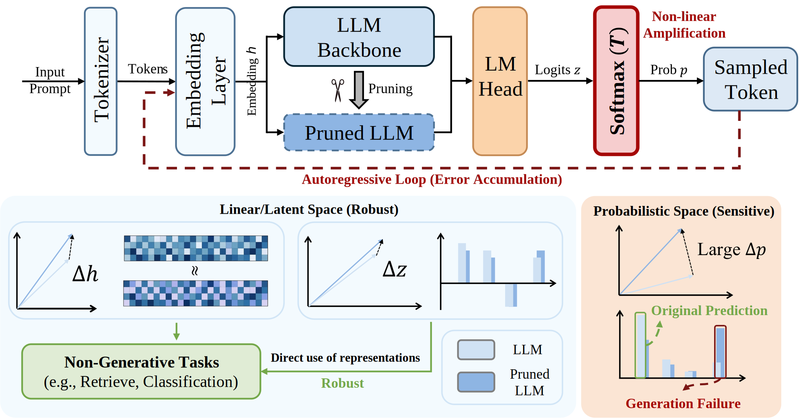
</p>
<p align="center">
  <em>Figure 1: Overview. This repo studies pruning through a representation hierarchy (`h → z → p`) and compares dense vs dropped/pruned behaviors.</em>
</p>

Pruning often preserves non-generative metrics but hurts autoregressive generation.
This repo studies that discrepancy through a representation hierarchy:
- **Embedding space** (`h`): hidden states
- **Logit space** (`z`): pre-softmax outputs
- **Probability space** (`p`): post-softmax distributions

We provide analysis code for both **inter-layer** dropping (layer/block drop) and **intra-layer** sparsification (Wanda/SparseGPT), and paper-aligned scripts that quantify how pruning perturbs `h → z → p` across layers and decoding steps.

**What You Can Run Here**
- [Inter-layer pruning](inter-layer/) (layer / block drop)
- [Intra-layer pruning](intra-layer/) (Wanda / SparseGPT)
- [Representation-level analysis](representation-analysis/) in `dropped` and `pruned` modes


## Environment and Repository Structure

Install from `requirements.txt` (recommended, pinned versions):

```bash
pip install -r requirements.txt
```

- `inter-layer/`: layer/block dropping pipeline.
- `intra-layer/`: intra-layer sparsification (Wanda / SparseGPT).
- `representation-analysis/`: paper-aligned analysis scripts for representation hierarchy.


## Empirical Results

### Generative vs Non-generative Discrepancy

<table align="center">
  <tr>
    <td align="center" width="50%">
      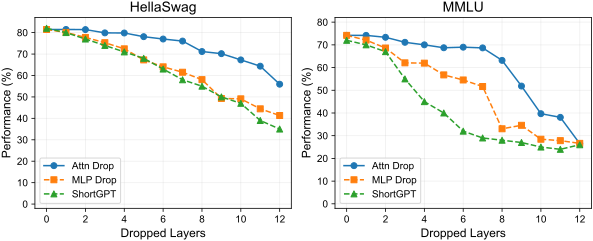
      <div align="center"><em>Figure 3: Pruning often preserves non-generative metrics (single-step / fixed-target evaluations).</em></div>
    </td>
    <td align="center" width="50%">
      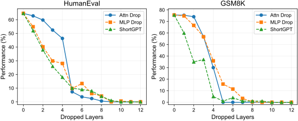
      <div align="center"><em>Figure 4: Pruning can hurt generative quality due to compounding errors during autoregressive decoding.</em></div>
    </td>
  </tr>
</table>

<p align="center">
  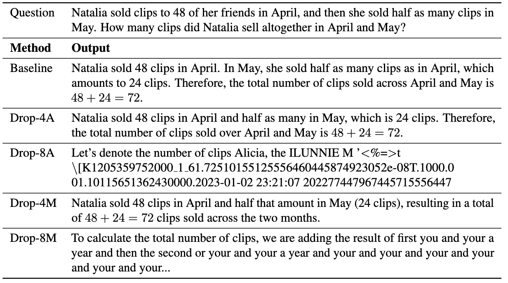
</p>
<p align="center">
  <em>Figure 5: After pruning, generation degrade qualitatively as decoding-time divergence propagets.</em>
</p>

## Distinct Observations Across Representation Spaces

<table align="center">
  <tr>
    <td align="center" width="50%">
      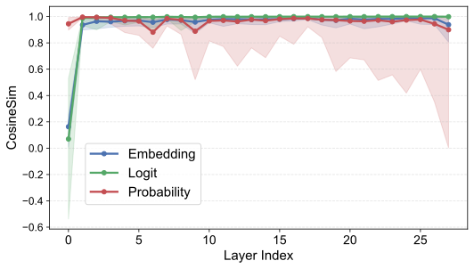
      <br/>
      <sub><strong>Attention</strong></sub>
    </td>
    <td align="center" width="50%">
      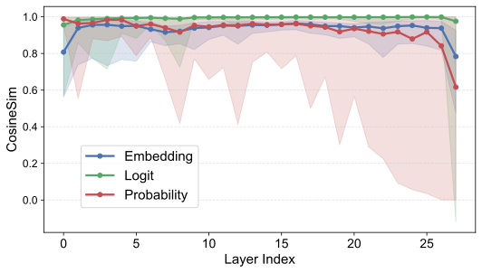
      <br/>
      <sub><strong>MLP</strong></sub>
    </td>
  </tr>
</table>
<p align="center">
  <em>Figure 2: Representation hierarchies under pruning. Layerwise latent similarity trends differ across embedding/logit/probability spaces (left: Attention, right: MLP).</em>
</p>

### Layerwise transition analysis

`representation-analysis/transition_layerwise_compare.py`
for dropped models
```bash
python transition_layerwise_compare.py \
  --analysis_mode dropped \
  --model_name Qwen/Qwen2.5-7B-Instruct \
  --dropped_root_path /path/to/dropped_results \
  --target_layer attn \
  --drop_n 8
```
for pruned models
```bash
python transition_layerwise_compare.py \
  --analysis_mode pruned \
  --model_name /path/to/dense_model \
  --pruned_model_name /path/to/pruned_model
```

Purpose:
- Compare **attn/mlp sublayer transitions** at the same layer and same context.
- Log transition metrics in embedding/logit/probability spaces. For example:
  - **Embedding/hidden space (`h`)**: cosine similarity `cos(h_residual, h_output)`, and the parallel/orthogonal decomposition of `Δh = h_output - h_residual` w.r.t. `h_residual` (relative parallel/orthogonal magnitudes).
  - **Logit space (`z`)**: cosine similarity `cos(z_residual, z_output)`, plus the parallel/orthogonal decomposition of `Δz = z_output - z_residual` w.r.t. `z_residual`.
  - **Probability space (`p`)**: cosine similarity `cos(p_residual, p_output)` where `p = softmax(z/T)`, and `KL(p_output || p_residual)` (reported as `REAL_KL` in logs).
  - **Second-order estimates (paper-aligned)**: `KL_estimate` and `1-cos_estimate` computed from weighted variance terms with the `1/(2T^2)` scaling.


## Theoretical Theorems

**Theorem 1 (Local Deviation Induced by Pruning)**

For cosine similarity in the embedding space, the deviation induced by pruning can be approximately characterized via a second-order Taylor expansion (see Appendix C.1 in the paper).

<p align="center">
  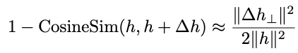
</p>

**Theorem 2 (Sensitivity of Probability Space to Logit Perturbations)**

To compare probability-space and logit-space deviations on the same footing, we rewrite probability-space deviation in terms of the logit variable $z$ (rather than applying Theorem 1 directly). Using a second-order Taylor expansion (see Appendix C.2), the probability-space cosine similarity admits a tractable approximation.

<p align="center">
  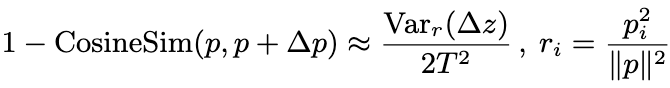
</p>

**Theorem 3 (Distributional Shift under Pruning)**

In probability space, KL divergence is a standard measure of distributional shift under pruning. Based on the derivation in Appendix B, the pruning-induced KL can be approximated in a closed form.

<p align="center">
  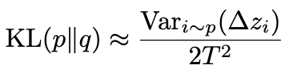
</p>

## Empirical Support and Key Findings

### Matching Theorems to Observations

<table align="center">
  <tr>
    <td align="center" width="50%">
      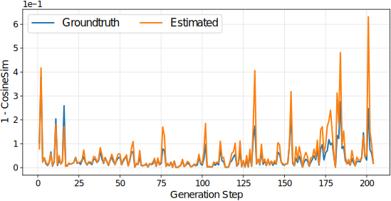
      <div align="center"><sub><strong>Angular Deviation</strong></sub></div>
    </td>
    <td align="center" width="50%">
      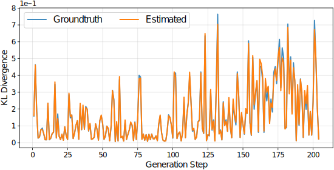
      <div align="center"><sub><strong>KL Divergence</strong></sub></div>
    </td>
  </tr>
</table>
<p align="center">
  <em>Figure 6: Example layerwise signals. Cosine similarity and KL divergence can show different sensitivity across spaces at the same layer (illustrative Attention layer).</em>
</p>

### Top Tokens vs. Option Subspaces

<table align="center">
  <tr>
    <td align="center" width="50%">
      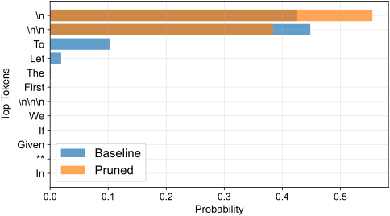
      <div align="center"><sub><strong>Top Tokens</strong></sub></div>
    </td>
    <td align="center" width="50%">
      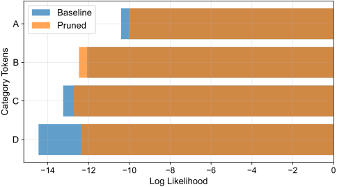
      <div align="center"><sub><strong>Categorical Tokens</strong></sub></div>
    </td>
  </tr>
</table>
<p align="center">
  <em>Figure 7: Subspace vs global behavior. Comparing answer-option subspaces with full-vocabulary behavior reveals why some non-generative scores remain stable.</em>
</p>

### Task subspace analysis (MCQ)

`representation-analysis/compare_mcq_subspace_metrics.py`

Run (dropped):

```bash
python compare_mcq_subspace_metrics.py \
  --analysis_mode dropped \
  --model_name Qwen/Qwen2.5-7B-Instruct \
  --dropped_root_path /path/to/dropped_results \
  --target_layer attn \
  --drop_n 8
```

Run (pruned):

```bash
python compare_mcq_subspace_metrics.py \
  --analysis_mode pruned \
  --model_name /path/to/dense_model \
  --pruned_model_name /path/to/pruned_model
```

Purpose:
- Compare global vocabulary-space behavior vs answer-option subspace behavior.
- Mirrors the non-generative subspace robustness discussion in the paper.


### Pruning-Induced Errors During Autoregressive Decoding

<table align="center">
  <tr>
    <td align="center" width="50%">
      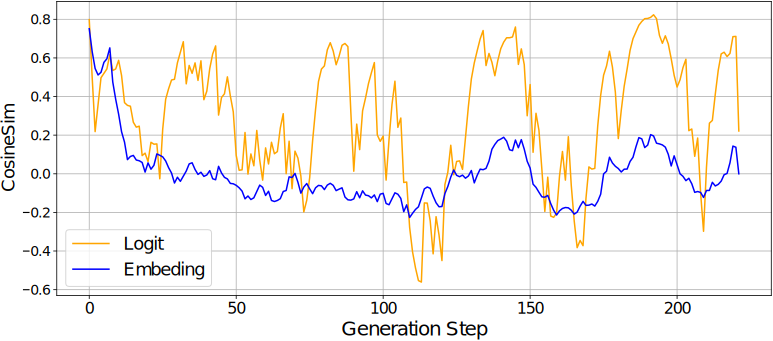
      <div align="center"><sub><strong>Embedding and Logits</strong></sub></div>
    </td>
    <td align="center" width="50%">
      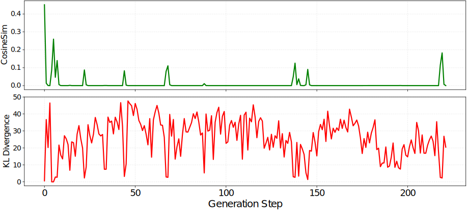
      <div align="center"><sub><strong>Probability Space</strong></sub></div>
    </td>
  </tr>
</table>
<p align="center">
  <em>Figure 8: Step-wise representation comparison during auto-regressive decoding. Embedding/logit similarity can remain high while probability-space similarity (vocabulary distribution) shows larger deviation.</em>
</p>

### Generation-time divergence analysis

`representation-analysis/compare_generation_metrics.py`

Run (dropped):

```bash
python compare_generation_metrics.py \
  --analysis_mode dropped \
  --model_name Qwen/Qwen2.5-7B-Instruct \
  --dropped_root_path /path/to/dropped_results \
  --target_layer attn \
  --drop_n 8
```

Run (pruned):

```bash
python compare_generation_metrics.py \
  --analysis_mode pruned \
  --model_name /path/to/dense_model \
  --pruned_model_name /path/to/pruned_model
```

Purpose:
- Compare dense vs target trajectories across decoding steps.
- Report cosine/KL and second-order estimates tied to the paper’s Section 6 formulas.


## Acknowledgements

- Inter-layer layer/block dropping is adapted from [LLM-Drop](https://github.com/CASE-Lab-UMD/LLM-Drop)
- Intra-layer pruning builds on [Wanda](https://github.com/locuslab/wanda) and [SparseGPT](https://github.com/IST-DASLab/sparsegpt)

## Citation

If this repository helps your research, please cite the corresponding paper.
