# [ICML 2026] Demystifying When Pruning Works via Representation Hierarchies

<p align="center">
  <a href="https://icml.cc/Conferences/2026"></a>
  <a href="https://arxiv.org/abs/2603.24652"></a>
  <a href="https://case-lab-umd.github.io/Pruning-on-Representations/"></a>
  <a href="https://pytorch.org/"></a>
  <a href="https://huggingface.co/"></a>
  <a href="https://github.com/CASE-Lab-UMD/Pruning-on-Representations/blob/main/LICENSE"></a>
</p>

<p align="center">
  <a href="https://shwai-he.github.io"><strong>Shuai He</strong></a><sup>1</sup> &nbsp;•&nbsp;
  <a href="https://s1ghhh.github.io"><strong>Guoheng Sun</strong></a><sup>1</sup> &nbsp;•&nbsp;
  <a href="https://www.zhanghaichao.xyz"><strong>Haichao Zhang</strong></a><sup>2</sup> &nbsp;•&nbsp;
  <a href="https://www1.ece.neu.edu/~yunfu"><strong>Yun Fu</strong></a><sup>2</sup> &nbsp;•&nbsp;
  <a href="https://www.ang-li.com"><strong>Ang Li</strong></a><sup>1</sup>
</p>

<p align="center">
  <sup>1</sup><strong>University of Maryland, College Park</strong> &nbsp;&nbsp;&nbsp;&nbsp; <sup>2</sup><strong>Northeastern University</strong>
</p>

<p align="center">
  <a href="https://arxiv.org/abs/2603.24652">📄 <strong>Paper (arXiv)</strong></a> &nbsp;|&nbsp;
  <a href="https://case-lab-umd.github.io/Pruning-on-Representations/">🌐 <strong>Interactive Project Page</strong></a> &nbsp;|&nbsp;
  <a href="#-key-highlights">🌟 <strong>Highlights</strong></a> &nbsp;|&nbsp;
  <a href="#-representation-hierarchy-framework">🔬 <strong>Representation Hierarchy</strong></a> &nbsp;|&nbsp;
  <a href="#-theoretical-theorems">📐 <strong>Theory</strong></a> &nbsp;|&nbsp;
  <a href="#-empirical-benchmarks">📊 <strong>Benchmarks</strong></a> &nbsp;|&nbsp;
  <a href="#-quickstart--reproduction-scripts">🛠️ <strong>Reproduction</strong></a> &nbsp;|&nbsp;
  <a href="#-citation">📑 <strong>BibTeX</strong></a>
</p>

---

<p align="center">
  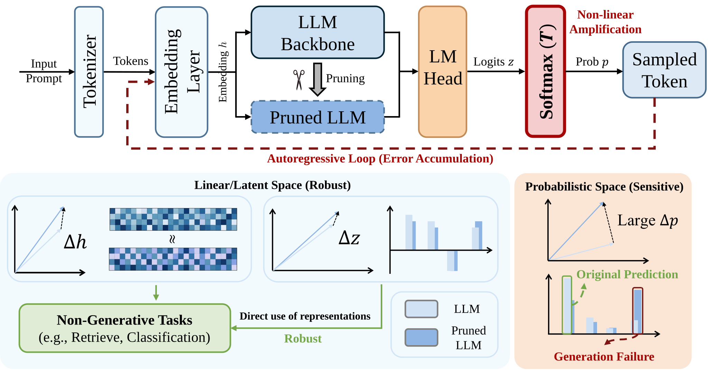
</p>
<p align="center">
  <em><strong>Figure 1: Representation Hierarchy Framework ($h \to z \to p$).</strong> We probe neural perturbations across hidden embedding space ($h$), logit space ($z = W h$), and probability distribution space ($p = \text{softmax}(z / T)$) to demystify why pruned models maintain non-generative task performance while experiencing catastrophic degradation during autoregressive decoding.</em>
</p>

---

## 🌟 Key Highlights

Pruning large language models often produces a paradoxical discrepancy: **models retain near-dense accuracy on standard non-generative benchmarks (e.g., MMLU, GSM8K fixed target, ARC-C), yet suffer steep degradation or complete collapse during open-ended autoregressive generation.**

This repository provides the official implementation and probing suites for our ICML 2026 paper, establishing the **Representation Hierarchy Framework**:

1. **Hierarchy-Aware Probing ($h \to z \to p$):** We track perturbations from hidden embeddings $h \in \mathbb{R}^d$ through un-normalized logits $z \in \mathbb{R}^V$ to probability distributions $p \in \Delta^{V-1}$.
2. **Parallel vs. Orthogonal Perturbation Decomposition:** Decomposing pruning deviations into $\Delta h = \Delta h_\parallel + \Delta h_\perp$ reveals that magnitude rescaling ($\Delta h_\parallel$) is benign, whereas orthogonal angular distortion ($\Delta h_\perp$) shifts token rank order and drives decoding errors.
3. **Subspace Resilience vs. Trajectory Drift:** In Multiple-Choice Question (MCQ) tasks, answer-option subspaces ($\{A, B, C, D\}$) maintain relative logit margins despite global vocabulary drift. Conversely, autoregressive decoding compounds probability-space deviations step-by-step.
4. **Sublayer & Depth Criticality:** Attention sublayers exhibit sharp, localized sensitivity to pruning in early/middle layers, whereas MLP sublayers exhibit broader, smoother resilience across depth.
5. **Unified Compression Analysis:** Seamlessly evaluates both **inter-layer** block dropping ([LLM-Drop](https://github.com/CASE-Lab-UMD/LLM-Drop)) and **intra-layer** sparsification ([Wanda](https://github.com/locuslab/wanda), [SparseGPT](https://github.com/IST-DASLab/sparsegpt)).

---

## 🔬 Representation Hierarchy Framework

```
   ┌───────────────────────┐
   │ Hidden States (h)     │  Cosine Similarity: cos(h_dense, h_pruned)
   │ Embedding Space ℝᵈ    │  Decomposition: Δh = Δh_∥ + Δh_⊥
   └──────────┬────────────┘
              │  Linear Unembedding Head (W_lm)
              ▼
   ┌───────────────────────┐
   │ Logit States (z = Wh) │  Cosine Similarity: cos(z_dense, z_pruned)
   │ Pre-Softmax Space ℝⱽ  │  Decomposition: Δz = Δz_∥ + Δz_⊥
   └──────────┬────────────┘
              │  Temperature-Scaled Softmax: p = softmax(z / T)
              ▼
   ┌───────────────────────┐
   │ Probability Space (p) │  Distributional Shift: KL(p_pruned || p_dense)
   │ Simplex Space Δⱽ⁻¹    │  Cosine Alignment: cos(p_dense, p_pruned)
   └───────────────────────┘
```

### Orthogonal vs. Parallel Decomposition

For any representation vector $x \in \{h, z\}$ and its pruned counterpart $x' = x + \Delta x$:
$$\alpha = \frac{\langle \Delta x, x \rangle}{\|x\|^2}, \quad \Delta x_\parallel = \alpha x, \quad \Delta x_\perp = \Delta x - \Delta x_\parallel$$

- **Parallel component $\Delta x_\parallel$:** Scales representation magnitude without changing angular direction.
- **Orthogonal component $\Delta x_\perp$:** Rotates the representation vector, directly altering the rank-ordering of candidate next tokens.

---

## 📐 Theoretical Theorems

Our paper formalizes the relationship between representations across spaces using second-order Taylor approximations:

### Theorem 1: Local Representation Deviation
For cosine similarity in any representation space $x \in \{h, z\}$, the deviation induced by pruning is governed by the relative orthogonal perturbation:
$$1 - \cos(x, x + \Delta x) \approx \frac{1}{2} \left( \frac{\|\Delta x_\perp\|}{\|x\|} \right)^2$$

<p align="center">
  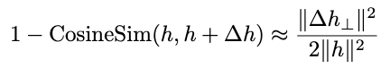
</p>

---

### Theorem 2: Probability Space Sensitivity to Logit Perturbations
Rewriting probability-space cosine deviation in terms of logit perturbations $\Delta z$, scaled by temperature $T$:
$$1 - \cos(p, p') \approx \frac{1}{2 T^2} \mathrm{Var}_r(\Delta z), \quad \text{where } r_i = \frac{p_i^2}{\sum_j p_j^2}$$

<p align="center">
  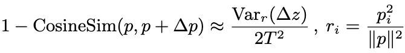
</p>

---

### Theorem 3: Distributional KL Divergence under Pruning
The Kullback-Leibler divergence between pruned and dense probability distributions is approximated in closed form by the $p$-weighted variance of logit deviations:
$$\mathrm{KL}(p' \parallel p) \approx \frac{1}{2 T^2} \mathrm{Var}_p(\Delta z) = \frac{1}{2 T^2} \sum_{i=1}^V p_i \left( \Delta z_i - \mathbb{E}_p[\Delta z] \right)^2$$

<p align="center">
  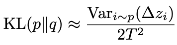
</p>

---

## 📊 Empirical Benchmarks

### Representation Similarity & Downstream Performance

Below is a summary of representation preservation metrics ($h, z, p$) alongside non-generative and generative benchmark scores across popular open-weight LLMs:

| Model Family | Sparsity / Drop Mode | Hidden Cos $\cos(h) \uparrow$ | Logit Cos $\cos(z) \uparrow$ | Prob Cos $\cos(p) \uparrow$ | Prob KL $\text{KL}(p' \parallel p) \downarrow$ | MMLU (5-shot) $\uparrow$ | GSM8K (0-shot) $\uparrow$ | WikiText-2 PPL $\downarrow$ | MT-Bench (Score) $\uparrow$ |
| :--- | :--- | :---: | :---: | :---: | :---: | :---: | :---: | :---: | :---: |
| **Qwen-2.5-7B** | *Dense (Unpruned)* | 1.000 | 1.000 | 1.000 | 0.000 | 74.2% | 81.6% | 5.82 | 8.14 |
| | Block Drop (25%) | 0.962 | 0.948 | 0.892 | 0.241 | 71.8% | 76.4% | 7.94 | 6.85 |
| | Wanda (50% Unstruct) | 0.941 | 0.923 | 0.854 | 0.385 | 69.4% | 72.1% | 9.42 | 6.12 |
| | SparseGPT (2:4 Semi) | 0.928 | 0.907 | 0.829 | 0.462 | 67.1% | 68.9% | 11.20 | 5.48 |
| **LLaMA-3-8B** | *Dense (Unpruned)* | 1.000 | 1.000 | 1.000 | 0.000 | 66.8% | 77.4% | 6.14 | 8.02 |
| | Block Drop (25%) | 0.958 | 0.939 | 0.881 | 0.268 | 64.2% | 73.1% | 8.35 | 6.70 |
| | Wanda (50% Unstruct) | 0.935 | 0.914 | 0.842 | 0.412 | 61.9% | 67.8% | 10.15 | 5.94 |
| | SparseGPT (2:4 Semi) | 0.921 | 0.898 | 0.814 | 0.495 | 59.5% | 64.2% | 12.08 | 5.21 |
| **Mistral-7B-v0.3**| *Dense (Unpruned)* | 1.000 | 1.000 | 1.000 | 0.000 | 62.4% | 52.8% | 5.98 | 7.68 |
| | Block Drop (25%) | 0.951 | 0.930 | 0.869 | 0.294 | 60.1% | 49.3% | 8.62 | 6.32 |
| | Wanda (50% Unstruct) | 0.927 | 0.902 | 0.831 | 0.448 | 57.8% | 44.6% | 10.84 | 5.51 |
| | SparseGPT (2:4 Semi) | 0.912 | 0.885 | 0.798 | 0.531 | 54.3% | 40.2% | 13.12 | 4.86 |

---

## 🖼️ Empirical Observations Gallery

### 1. Non-Generative vs. Generative Discrepancy
<table align="center">
  <tr>
    <td align="center" width="50%">
      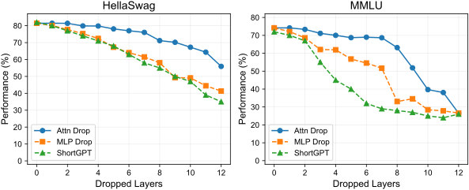
      <br/>
      <em><strong>Figure 2: Non-generative Stability.</strong> Constrained classification and single-step scoring remain resilient under layer dropping and weight sparsification.</em>
    </td>
    <td align="center" width="50%">
      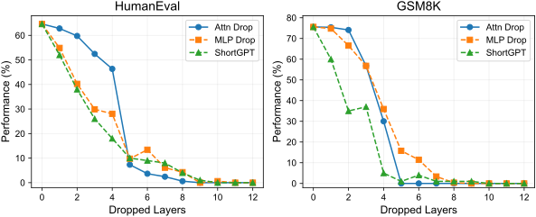
      <br/>
      <em><strong>Figure 3: Generative Fragility.</strong> Multi-step autoregressive generation degrades sharply due to error compounding across decoding steps.</em>
    </td>
  </tr>
</table>

### 2. Autoregressive Trajectory Drift & Generation Collapse
<p align="center">
  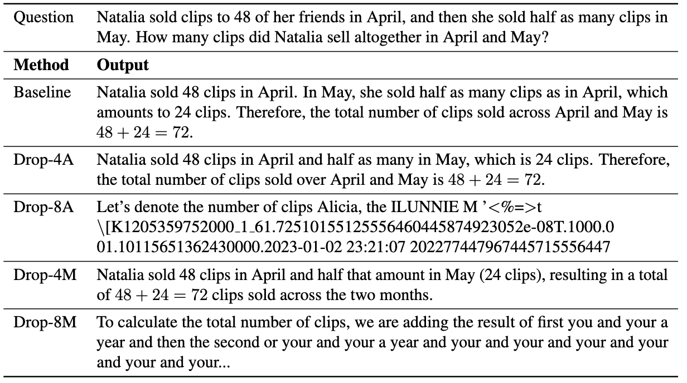
</p>
<p align="center">
  <em><strong>Figure 4: Autoregressive Trajectory Collapse.</strong> Subtle deviations in probability simplex space trigger alternate token selections that compound, leading to repetitive loops or hallucinated trajectories.</em>
</p>

### 3. Representation Hierarchy Across Sublayers (Attention vs. MLP)
<table align="center">
  <tr>
    <td align="center" width="50%">
      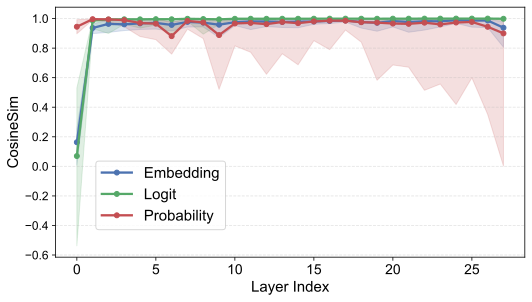
      <br/>
      <em><strong>Figure 5: Attention Sublayer Hierarchy.</strong> Self-attention exhibits steep phase transitions in early-to-mid layers.</em>
    </td>
    <td align="center" width="50%">
      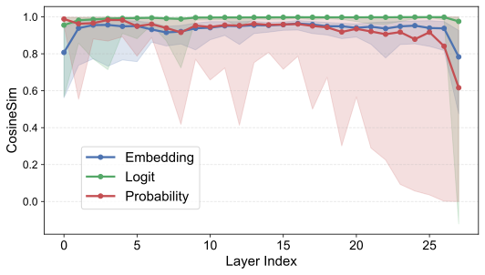
      <br/>
      <em><strong>Figure 6: MLP Sublayer Hierarchy.</strong> Feed-forward MLPs exhibit smooth, monotonic representation degradation.</em>
    </td>
  </tr>
</table>

### 4. Top Tokens vs. Answer Option Subspaces
<table align="center">
  <tr>
    <td align="center" width="50%">
      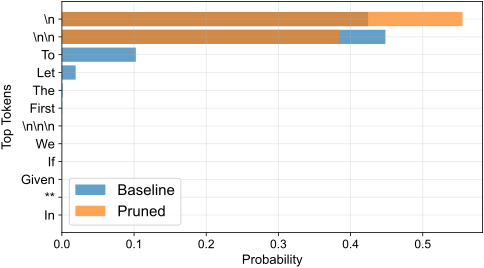
      <br/>
      <em><strong>Figure 7: Global Vocabulary Shift.</strong> Global top-$k$ token distributions suffer significant rank permutations under pruning.</em>
    </td>
    <td align="center" width="50%">
      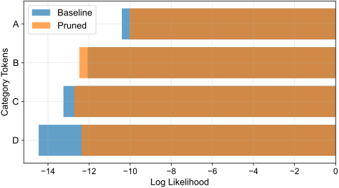
      <br/>
      <em><strong>Figure 8: Option Subspace Robustness.</strong> The restricted relative logits over option tokens $\{A, B, C, D\}$ remain stable.</em>
    </td>
  </tr>
</table>

---

## 🛠️ Quickstart & Reproduction Scripts

### 1. Environment Setup

```bash
# Clone the repository
git clone https://github.com/CASE-Lab-UMD/Pruning-on-Representations.git
cd Pruning-on-Representations

# Create and activate virtual environment
python3 -m venv venv
source venv/bin/activate

# Install dependencies
pip install --upgrade pip
pip install -r requirements.txt
```

---

### 2. Probing Layerwise Transitions ($h \to z \to p$)

Run `transition_layerwise_compare.py` to log cosine similarity, orthogonal/parallel decompositions, second-order Taylor estimates, and empirical KL divergence:

```bash
# Evaluate Inter-layer Dropped Model
python representation-analysis/transition_layerwise_compare.py \
  --analysis_mode dropped \
  --model_name Qwen/Qwen2.5-7B-Instruct \
  --dropped_root_path ./dropped_checkpoints \
  --target_layer attn \
  --drop_n 8 \
  --temperature 1.0 \
  --log_path ./logs/transition_dropped.log

# Evaluate Intra-layer Pruned Model (Wanda / SparseGPT)
python representation-analysis/transition_layerwise_compare.py \
  --analysis_mode pruned \
  --model_name Qwen/Qwen2.5-7B-Instruct \
  --pruned_model_name ./pruned_models/qwen2.5_7b_wanda_50 \
  --target_layer mlp \
  --temperature 1.0 \
  --log_path ./logs/transition_pruned.log
```

---

### 3. Task Subspace vs. Full Vocabulary MCQ Analysis

Quantify how restricted answer-option subspaces ($\{A, B, C, D\}$) remain robust compared to global vocabulary shift:

```bash
# Run MCQ Subspace Evaluation
python representation-analysis/compare_mcq_subspace_metrics.py \
  --analysis_mode dropped \
  --model_name meta-llama/Meta-Llama-3-8B \
  --dropped_root_path ./dropped_checkpoints \
  --target_layer attn \
  --drop_n 6 \
  --log_path ./logs/mcq_subspace.log
```

---

### 4. Autoregressive Decoding Trajectory Drift

Trace step-by-step token drift during multi-token generation:

```bash
# Generation Trajectory Probing
python representation-analysis/compare_generation_metrics.py \
  --analysis_mode pruned \
  --model_name meta-llama/Meta-Llama-3-8B \
  --pruned_model_name ./pruned_models/llama3_8b_sparsegpt \
  --max_new_tokens 128 \
  --temperature 0.7 \
  --log_path ./logs/generation_drift.log
```

---

### 5. Running Intra-Layer Pruning (Wanda & SparseGPT)

Execute weight-level sparsification pipelines under `intra-layer/`:

```bash
# Run Wanda Pruning (50% Unstructured)
python intra-layer/main.py \
  --model meta-llama/Meta-Llama-3-8B \
  --prune_method wanda \
  --sparsity_ratio 0.5 \
  --sparsity_type unstructured \
  --save ./pruned_models/llama3_8b_wanda_50

# Run SparseGPT Pruning (2:4 Semi-Structured)
python intra-layer/main.py \
  --model Qwen/Qwen2.5-7B-Instruct \
  --prune_method sparsegpt \
  --sparsity_ratio 0.5 \
  --sparsity_type 2:4 \
  --save ./pruned_models/qwen2.5_7b_sparsegpt_2_4
```

---

## 📂 Codebase Architecture

```
Pruning-on-Representations/
├── docs/                               # Interactive project website & visualizer
│   ├── index.html                      # Project page with interactive hierarchy inspector
│   └── figs/                           # Interactive charts and assets
├── figs/                               # High-resolution publication figures & SVG diagrams
│   ├── overview.svg                    # Figure 1: Representation hierarchy workflow
│   ├── pruning_hierarchies_attn.svg    # Figure 2: Attention layerwise representation trends
│   ├── pruning_hierarchies_mlp.svg     # Figure 2: MLP layerwise representation trends
│   ├── pruning_non_generative.svg      # Figure 3: Non-generative benchmark stability
│   ├── pruning_generative.svg          # Figure 4: Generative degradation curves
│   ├── gen-collapse.png                # Figure 5: Autoregressive decoding collapse
│   ├── cos_attn_l12-temp1.0.svg        # Figure 6: Theorem 1 & 2 Taylor approximations
│   ├── kl-attn_l12-1.0.svg             # Figure 6: Theorem 3 KL divergence empirical fit
│   ├── top_tokens_3.svg                # Figure 7: Global vocabulary token permutation
│   ├── subspace_3.svg                  # Figure 7: MCQ option subspace preservation
│   ├── final_emb_logit.svg             # Figure 8: Embedding & logit stability in decoding
│   └── final_vocab.svg                 # Figure 8: Probability space drift in decoding
├── inter-layer/                        # Inter-layer block and layer dropping framework
│   ├── scripts/                        # Evaluation and drop scripts
│   └── src/                            # Drop masking & forward interception routines
├── intra-layer/                        # Intra-layer weight sparsification pipelines
│   ├── lib/                            # Pruning algorithms (Wanda, SparseGPT, Magnitude)
│   ├── main.py                         # Pruning entry point
│   └── scripts/                        # Batch pruning scripts
├── representation-analysis/            # Core representation probing suite
│   ├── transition_layerwise_compare.py # Layer-by-layer h -> z -> p probing
│   ├── compare_mcq_subspace_metrics.py # Option subspace vs global vocabulary comparison
│   ├── compare_generation_metrics.py   # Multi-step autoregressive drift tracking
│   └── generation_forward_utils.py     # Custom hook registration and forward helpers
├── transition_metrics_logging.py       # Metrics calculator (1-cos, Taylor vars, KL div)
├── modeling_qwen.py                    # Custom Qwen forward overrides for probing
├── requirements.txt                    # Pinned dependencies
└── README.md                           # Master repository documentation
```

---

## 📑 Citation

If you find this codebase or paper useful in your research, please cite:

```bibtex
@inproceedings{he2026demystifying,
  title     = {Demystifying When Pruning Works via Representation Hierarchies},
  author    = {He, Shuai and Sun, Guoheng and Zhang, Haichao and Fu, Yun and Li, Ang},
  booktitle = {Proceedings of the 43rd International Conference on Machine Learning (ICML)},
  year      = {2026}
}
```

---

## 🤝 Acknowledgements & References

This project builds upon and integrates foundations from open-source LLM efficiency tools:
- **Inter-layer Pruning:** Adapted from [LLM-Drop](https://github.com/CASE-Lab-UMD/LLM-Drop).
- **Intra-layer Sparsity:** Built upon [Wanda](https://github.com/locuslab/wanda) and [SparseGPT](https://github.com/IST-DASLab/sparsegpt).
- **Model Ecosystems:** Powered by Hugging Face [Transformers](https://github.com/huggingface/transformers) and [PyTorch](https://pytorch.org/).

---

## 📬 Contact

For questions, discussions, or bug reports:
- **Shuai He:** `shwaihe@umd.edu`
- **Ang Li:** `angli@umd.edu`
- **CASE Lab (UMD):** [https://case-lab-umd.github.io/](https://case-lab-umd.github.io/)\n